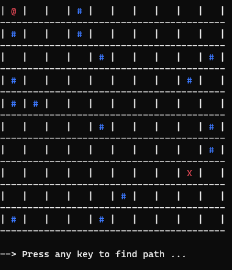

# A* Pathfinding algorithm

- This is a simple implementation of the A* algorithm with C#. 
- The program does not use diagonal movement to find the best path (Manhattan distance like).
- Walls are blue #, marked path are green *, and start, end tiles are red @, X.
- Below are two screenshots of the expected output:

